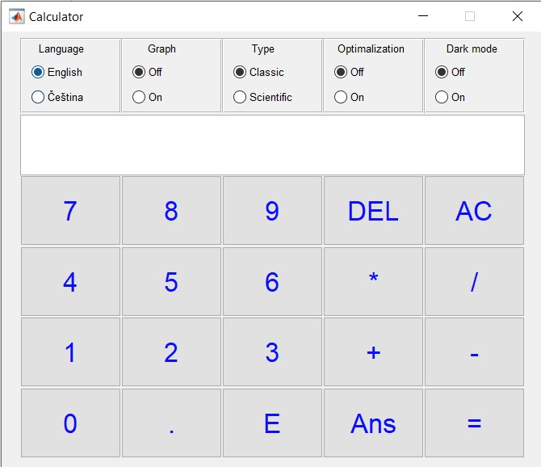
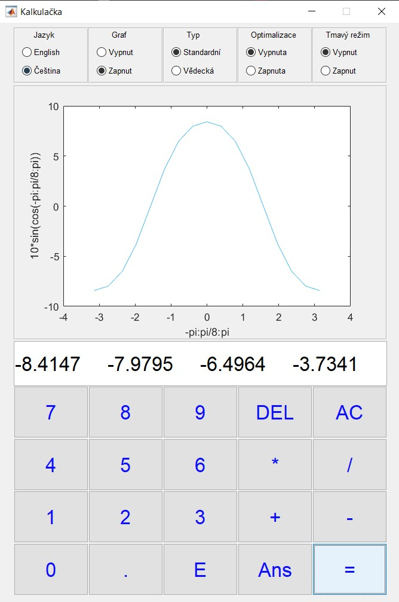
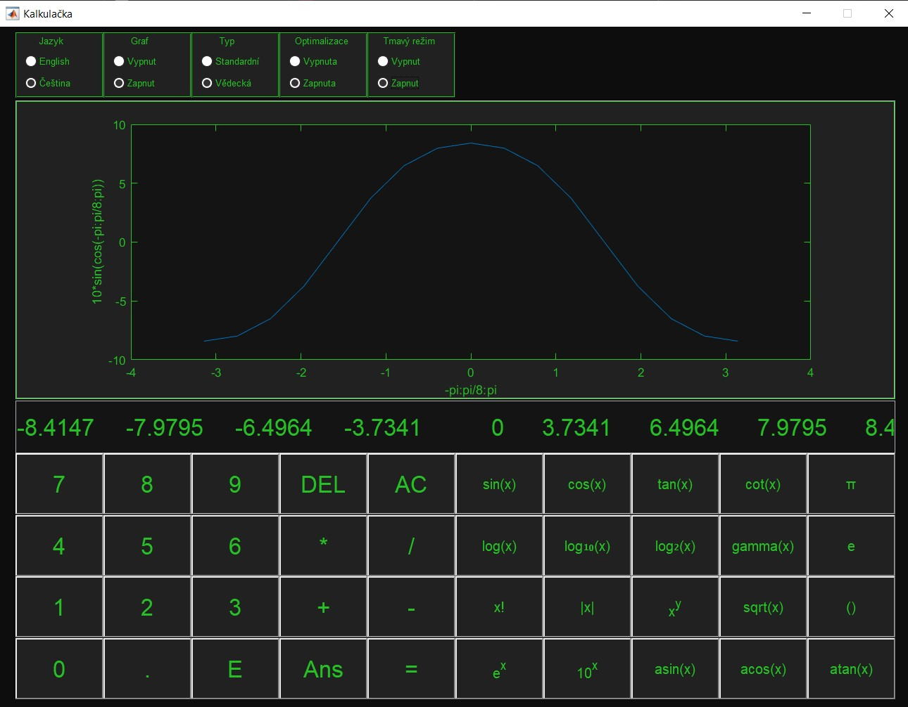

# BPC-PP1
* Počítačové programování 1
* Finální projekt: Základní/Vědecká grafická kalkulačka

## Finální projekt (body 50/50):
* [Hlavní skript](calc.m)
* [Pomocné funkce](calcFunctions.m)

## Funkce kalkulačky:
* Nastavitelný jazyk: EN/CZECH
* Graf: On/Off
* Typ: Klasická/Vědecká
* Optimalizace vykreslování grafu: On/Off
* Temný mód: On/Off

## Vykreslování grafů
* Pro vykreslení grafů musí být zapnut graf a do pole se zadá interval ve tvaru "první číslo:krok:poslední číslo"
* Tento interval se dá dát do různých funkcí a tím vykreslí danou funkci nad daným intervalem, př.: 10*sin(-pi:pi/8:pi)
* Funkce se mohou vkládat do dalších funkcí, avšak interval může být jen jeden

* Obrázky:

